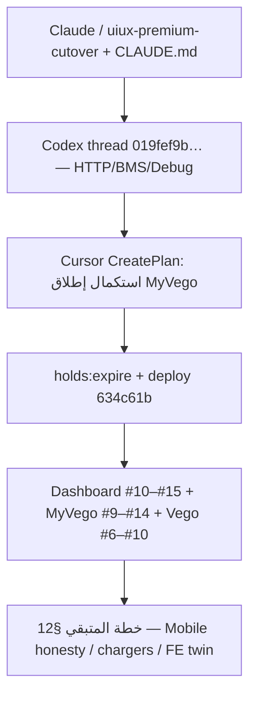

# هاند أوفر موحّد — إطلاق IoT / SuperAdmin / MyVego

> **الحالة:** منشور على الإنتاج (2026-08-11)  
> **الغرض:** مرجع واحد للتطوير اللاحق + فحص QA + تشخيص + ضمان جودة سلسلة  
> `FE → API → IoT Engine → Device → DB`  
> **مصدر السرد:** جلسة Claude/Cursor السابقة + Codex `019fef9b-505c-7892-a448-9e7d94681bc7` + جلسة Cursor الحالية `bdb3f9ab-63a9-4d91-a8f9-375b9272b7cd`

---

## 0) ملخص تنفيذي (للقيادة وQA)

| السؤال | الجواب المختصر |
|--------|----------------|
| ماذا كان المطلوب؟ | ربط HTTP حقيقي للكبائن، Debug يعمل، BMS/SOC صادقة، لا soft-lie في UI/API، إطلاق بلا فجوات |
| ماذا كان قبل؟ | SOC كاذب في Twin، Debug بلا `http_cloud`، UI يعتبر HTTP 200 نجاحاً، Fleet يقلب DB رغم فشل IoT، open-slot يفشل إن الباب مفتوح مسبقاً |
| ماذا صار الآن؟ | Cutover Laravel→Vego مؤكد، receipts صادقة، Type=`16S` / SOH=`—`، open-slot confirmed على باب مفتوح، الثلاثة مستودعات منشورة |
| هل كل شيء مغلق؟ | **لا** — Mobile vehicle ما زال متفائلاً؛ عقد vehicle يسمح `accepted_unconfirmed`؛ الشواحن offline؛ بعض صفحات FE بلا twin SSOT كامل |
| أين نبدأ غداً؟ | §12 خطة العمل المتبقية + §11 مصفوفة QA |

### لقطة الإنتاج الحالية (بعد آخر نشر)

| طبقة | Repo | Prod HEAD | مضيف |
|------|------|-----------|------|
| Dashboard | `vego-group/vego-superadmin-dashboard` | **`8afb89f`** (PR #15) | https://vego-superadmin-dashboard.vercel.app |
| MyVego API | `vego-group/myvego-backend` | **`a23cc6a`** (PR #14) | https://mobility-live.com → EC2 `18.166.65.185` |
| Vego IoT | `mahmoudps/Vego-IoT-Engine` | **`fd0e2c8`** (PR #10) | https://app.iot.vego.sa + https://debug.iot.vego.sa → `178.105.26.213:/opt/vego-iot` |

### كاناري مثبت حيّاً (آخر جولة)

| فحص | نتيجة |
|------|--------|
| Ping `MXS202601140028` | `success:true`, online عبر twin |
| Sync cabinet | `success:true`, occupied=1 |
| Open-slot #1 (باب مفتوح مسبقاً) | **`delivery_status=confirmed`** ← إصلاح twin-noop |
| Query BMS slot 5 | `confirmed` |
| UI Slot 5 | Type=`16S`, SOC=`93%`, SOH=`—` (ليس `null`) |
| Health | API/IoT/Debug `200`، Dashboard `307→/login` |

---

## 1) خريطة الأنظمة (SSOT)

```text
[ SuperAdmin Dashboard / Vercel ]
        │  /api/proxy/*
        ▼
[ MyVego Laravel @ mobility-live.com ]
  - DB = SSOT تجاري (جلسات، محفظة، hold، إسقاطات محلية)
  - StationCommandService = بوابة أوامر المحطة (confirmed-only للجلسات)
  - VegoIoTService::command → app.iot.vego.sa
        ▼
[ Vego IoT Engine @ app.iot.vego.sa ]
  - Twin = SSOT فيزيائي للأجهزة
  - HTTP_CLOUD downlink للكبائن/الشواحن YHZN
  - MQTT = telemetry فقط (لا downlink بلا ADR)
        ▼
[ Vendor Go / جهاز حقيقي ]
        │ callbacks / twin events
        ▼
[ MyVego webhooks + SyncCabinetSlotState → DB ]
```

**قاعدة ذهبية:**  
- تقدّم جلسة swap/charge / فاتورة / Pass في Debug = فقط `delivery_status=confirmed`.  
- `accepted_unconfirmed` / timeout = حجز + reconciliation، **ليس نجاحاً تشغيلياً**.  
- Traits Laravel تبقى لـ merchant config / business orders / parse callbacks — **ليست** لـ device downlink.

مرجع العقد: [`docs/vendors/yhzn/LARAVEL-CUTOVER.md`](../vendors/yhzn/LARAVEL-CUTOVER.md)

---

## 2) المشكلة الأصلية (ماذا طلب المستخدم)

### 2.1 طلب Codex / قبل Cursor
1. التحقق من ربط **HTTP** بالكبائن end-to-end.
2. لماذا Debug https://debug.iot.vego.sa/ لا يتحكّم بالكبينة عبر HTTP؟
3. فرق الحقيقة في BMS/SOC (مرفق `vego-engine-cabinet-bms-soc.md`): Twin يعرض SOC=3/8 بينما المورد عبر `kwh` يعطي 100/49.
4. حل كل الفجوات قبل الإطلاق.

### 2.2 طلبات لاحقة في سلسلة الجلسات
- إصلاح `reserve` على slot → 422.
- فجوات UI↔API (vehicle paths، financial filter، logout…).
- Type/SOH تظهر `null` في واجهة الخزانة.
- فحص شامل FE→API→IoT→Device→DB + honesty + polish + commit/push/merge/deploy.
- ثم: ملف هاند أوفر شامل + مراجعة كل الخطط + خطة إكمال المتبقي.

---

## 3) مراجعة الخطط عبر الزمن (Claude → Codex → Cursor)



### 3.1 مرحلة Claude (سياق مضمّن)
- مهارة cutover + مراجعة مسار HTTP.
- توجيه معماري: لا MQTT downlink بلا ADR؛ HTTP_CLOUD هو مسار التحكم.
- تركيز على جودة UI/UX وصدق الحالة المعروضة.

### 3.2 مرحلة Codex (`019fef9b-505c-7892-a448-9e7d94681bc7`)
**الهدف:** قطع تحكم المحطة إلى المحرك + تصحيح BMS Twin + Debug.

ما أُنجز تقريباً في تلك المرحلة:
- Engine: HTTP station control، BMS من `kwh`، receipts، webhook continuity، أمن debug.
- MyVego: `StationCommandService`، cutover من Traits downlink، BMS migrations.
- نشر Vego إلى `/opt/vego-iot` (كان عند ~`54a0bdc` ثم تطوّر).
- MyVego PR #5–#7 (cutover + callbacks + BMS continuity).

فجوات بقيت بعد Codex (نقطة دخول Cursor):
- `holds:expire` يلغي hold دون تنسيق مع جلسات حية (P0).
- MyVego محلي متسخ / ملفات reconciler غير ملتزَمة.
- Debug UI / canary أبواب فارغة / شواحن offline.

### 3.3 مرحلة Cursor — الخطة الرسمية «استكمال إطلاق MyVego»
**CreatePlan** داخل الجلسة. النطاق:
1. إصلاح `holds:expire` + اختبارات.
2. Suite محلي → PR → drain → backup → migrate → canary.
3. عدم إعادة تنفيذ Engine إن كان نظيفاً.

**خارج النطاق صراحةً:** وحدات `v`/`cap` من المورد، MQTT downlink، rollback يعيد Traits.

### 3.4 مرحلة Cursor — موجات الإصلاح بعد الإطلاق
| موجة | ماذا | نتيجة |
|------|------|--------|
| A | holds/leases/reconciler | MyVego #8 → `634c61b` |
| B | UI↔API dashboard | Dashboard #10–#11، MyVego #9 |
| C | Honest receipts | MyVego #10–#11، Dashboard #12–#13 |
| D | Idempotency + open-slot probe + debug http_cloud | Vego #7–#9 |
| E | Type/SOH + BMS fields | MyVego #13، Dashboard #14 |
| F | Harmony كامل (هذه الجولة) | Dashboard #15، MyVego #14، Vego #10 |

### 3.5 حكم مراجعة الخطط
| الخطة | هل كانت صحيحة؟ | ماذا نقص؟ |
|-------|----------------|-----------|
| Claude cutover | صحيحة معمارياً (HTTP SSOT) | لم تغلق وحدها soft-lie في كل الطبقات |
| Codex HTTP/BMS | صحيحة وأغلقت جذر SOC الكاذب | تركت holds + UI honesty + twin-noop confirm |
| Cursor Plan A (holds) | صحيحة وP0 حقيقي | لم تشمل FE honesty ولا Fleet fail-closed |
| جولة Harmony الأخيرة | أغلقت معظم P0 المتبقية | Mobile vehicle + chargers + FE Devices twin ما زالت مفتوحة |

---

## 4) قبل → بعد (جدول تحوّل الحقيقة)

| الموضوع | قبل | بعد (إنتاج الآن) |
|---------|-----|------------------|
| SOC في Twin | قيم خام مضلّلة (3/8) | من BMS `kwh` → projection `soc_source=bms_kwh` |
| مسار تحكم الكابينة | Traits/vendor مباشر أو مختلط | `StationCommandService` → Vego `HTTP_CLOUD` |
| Debug transports | `tcp`/`mqtt` فقط غالباً | API + UI يشملان `http_cloud` |
| UI نجاح الأمر | `res.ok` / HTTP 200 | `res.ok && success===true` (+ delivery في open-door) |
| Type/SOH في UI | حرفياً `null` | Type=`16S` أو `—`؛ SOH=`—` إن غاب |
| Open-slot وباب مفتوح | `state_confirmation_timeout` | `confirmed` عبر `handle_projected_event` حتى مع twin-noop |
| Idempotency race | UniqueViolation → 500 | انتظار/settlement أو `accepted_unconfirmed` |
| Fleet vehicle control | يحدّث DB ثم يبلع فشل IoT | fail-closed: لا DB flip إن receipt مرفوض |
| SuperAdmin vehicle | أي 200 = OK | يفحص `delivery_status` |
| BMS webhook fields | يسقط `cell_count`/`soh` | يمرّران إلى `applyBmsEvent` |
| تصنيف internal_error | `transport_error` مضلّل | `engine_error` |

---

## 5) سجل Git / PRs الكامل ليوم الإطلاق (2026-08-11)

### 5.1 Dashboard — `vego-superadmin-dashboard`

| PR | Merge SHA | العنوان |
|----|-----------|---------|
| [#10](https://github.com/vego-group/vego-superadmin-dashboard/pull/10) | `1e16fa0` | محاذاة slot actions (`maintenance/empty/in_service`) |
| [#11](https://github.com/vego-group/vego-superadmin-dashboard/pull/11) | `2ff36b1` | فجوات UI↔API + Vercel build |
| [#12](https://github.com/vego-group/vego-superadmin-dashboard/pull/12) | `edb630c` | live sync + open-door + مسارات SSOT |
| [#13](https://github.com/vego-group/vego-superadmin-dashboard/pull/13) | `65c654a` | UI success فقط عند `success===true` |
| [#14](https://github.com/vego-group/vego-superadmin-dashboard/pull/14) | `3d3eb21` | null Type/SOH + auto-sync twin |
| [#15](https://github.com/vego-group/vego-superadmin-dashboard/pull/15) | **`8afb89f`** | honesty slot/vehicle + delayed sync بعد open-door + حذف mock orphans |

ملفات محورية بعد #15:
- `src/components/dashboard/cabinets/battery-swapping/detail/index.tsx`
- `src/components/dashboard/vehicle-control/vehicle-api.ts`
- `src/components/dashboard/vehicle-control/vehicle-details.tsx`
- `src/config/api.ts` (`STATION_IOT_*`)

### 5.2 MyVego — `myvego-backend`

| PR | Merge SHA | العنوان |
|----|-----------|---------|
| [#5](https://github.com/vego-group/myvego-backend/pull/5) | `e36b923` | Cut over station control + BMS truth |
| [#6](https://github.com/vego-group/myvego-backend/pull/6) | `62f24b9` | signed vendor callbacks bridge |
| [#7](https://github.com/vego-group/myvego-backend/pull/7) | `225dcdd` | BMS projection + Redis workers |
| [#8](https://github.com/vego-group/myvego-backend/pull/8) | `634c61b` | holds:expire منسّق مع الجلسات الحية |
| [#9](https://github.com/vego-group/myvego-backend/pull/9) | `a12ffcb` | wallet type filter |
| [#10](https://github.com/vego-group/myvego-backend/pull/10) | `7ce1811` | fail vehicle-control إن Vego غير موثوق |
| [#11](https://github.com/vego-group/myvego-backend/pull/11) | `d7c6f98` | honest station/vehicle receipts |
| [#12](https://github.com/vego-group/myvego-backend/pull/12) | `9d5de16` | idempotency scopes قابلة لإعادة التشغيل |
| [#13](https://github.com/vego-group/myvego-backend/pull/13) | `1e5e218` | battery type/SOH من BMS twin |
| [#14](https://github.com/vego-group/myvego-backend/pull/14) | **`a23cc6a`** | Fleet/SuperAdmin fail-closed + BMS fields + `engine_error` |

ملفات محورية:
- `app/Services/Iot/StationCommandService.php`
- `app/Http/Controllers/API/SuperAdmin/StationIotController.php`
- `app/Http/Controllers/API/SuperAdmin/VehicleController.php`
- `app/Http/Controllers/API/FleetAdmin/MotorcycleController.php`
- `app/Listeners/Iot/SyncCabinetSlotState.php`
- `app/Services/Iot/CabinetStateSyncService.php`
- `tests/Feature/Iot/StationCommandReceiptTest.php`

### 5.3 Vego IoT Engine

| PR | Merge SHA | العنوان |
|----|-----------|---------|
| [#1](https://github.com/mahmoudps/Vego-IoT-Engine/pull/1) | `d43eb3f` | HTTP station control + slot BMS cutover |
| [#2](https://github.com/mahmoudps/Vego-IoT-Engine/pull/2) | `755396d` | runtime schema قبل bootstrap |
| [#3](https://github.com/mahmoudps/Vego-IoT-Engine/pull/3) | `e170489` | أمن debug / least privilege |
| [#4](https://github.com/mahmoudps/Vego-IoT-Engine/pull/4) | `aa2000b` | vendor device-not-reply classification |
| [#5](https://github.com/mahmoudps/Vego-IoT-Engine/pull/5) | `54a0bdc` | webhook continuity لـ BMS |
| [#6](https://github.com/mahmoudps/Vego-IoT-Engine/pull/6) | `2847397` | توثيق Laravel cutover = DONE |
| [#7](https://github.com/mahmoudps/Vego-IoT-Engine/pull/7) | `afbe02e` | live slot probe بعد HTTP open |
| [#8](https://github.com/mahmoudps/Vego-IoT-Engine/pull/8) | `9304bc9` | debug `http_cloud` default |
| [#9](https://github.com/mahmoudps/Vego-IoT-Engine/pull/9) | `3ba5c7d` | idempotent replay بدل 500 |
| [#10](https://github.com/mahmoudps/Vego-IoT-Engine/pull/10) | **`fd0e2c8`** | twin-noop confirm + wait in-flight idempotency |

ملفات محورية:
- `engine/src/vego_engine/api/app.py` — استدعاء `handle_projected_event` حتى بدون patch
- `engine/src/vego_engine/core/services/dispatcher.py` — `_ack_from_idempotency_collision`
- `engine/src/vego_engine/persistence/repositories.py` — IntegrityError → IdempotencyReplayError دائماً
- `providers/yhzn/.../fast_charger/http_cloud/adapter.py` — soh/chargePowerW/workStep
- `web/src/routes/settings/ManufacturerTestersPanel.tsx` — defaults تشمل `http_cloud`

---

## 6) إجراءات النشر (Runbook مختصر كما نُفّذ)

### 6.1 Dashboard
- Push branch → `gh pr create` → `gh pr merge --merge --delete-branch`
- Vercel Production يتابع `main` تلقائياً (تحقق عبر `gh api .../deployments`)

### 6.2 MyVego (EC2 — لا يوجد git pull من GitHub على السيرفر)
```bash
# محلياً (Windows Git قد يرفض A..B الفارغ — استخدم main ^BASE)
git bundle create myvego-BASE-to-TIP.bundle main ^<prod_head>
scp -i IOS-new.pem myvego-….bundle ec2-user@18.166.65.185:/home/ec2-user/yhzn/myvego-app/backups/

# على السيرفر
cd /home/ec2-user/yhzn/myvego-app/src
# drain: stop queue + scheduler
git fetch bundle → merge --ff-only
chmod a+r composer.json   # مهم: 600 يكسر optimize:clear
docker compose exec myvego-app composer install --no-dev …
docker compose exec myvego-app php artisan migrate --force
docker compose exec myvego-app php artisan optimize:clear && optimize
docker compose up -d --no-deps myvego-queue
# scheduler عبر overlay compose
docker compose restart myvego-app myvego-queue
curl https://mobility-live.com/up
```

مفتاح SSH: `C:\Users\Mahmoud\.ssh\IOS-new.pem`  
مسار التطبيق: `/home/ec2-user/yhzn/myvego-app/`

### 6.3 Vego IoT
```bash
ssh -i C:\Development\vego.iot\.secrets\vego-iot-prod-root-20260514-091624-ed25519 \
  -o IdentitiesOnly=yes root@178.105.26.213
# إن فشل 22: ProxyCommand عبر ec2-user@18.166.65.185 + IOS-new.pem

cd /opt/vego-iot
git fetch origin && git pull --ff-only origin main
docker compose --env-file deploy/.env -f deploy/docker-compose.prod.yml build engine web
docker compose --env-file deploy/.env -f deploy/docker-compose.prod.yml up -d engine web
```
مرجع كامل: [`docs/runbooks/deploy.md`](../runbooks/deploy.md)

---

## 7) عقود الصدق (Honesty Contracts) — يجب أن يحفظها QA

### 7.1 Station / Swap / Charge (صارم)
| `delivery_status` | هل `success:true`؟ | أثر |
|-------------------|---------------------|-----|
| `confirmed` | نعم | تقدّم جلسة / Pass |
| `accepted_unconfirmed` | لا (station-iot) | reconciliation |
| `state_confirmation_timeout` | لا (غالباً 202) | شاهد باب/منفذ |
| `timeout` / `vendor_transport_error` / `engine_error` / `transport_error` | لا | فشل |

أوامر المحطة في API تستخدم الأسماء الكانونية:
- `cabinet_open_slot`, `cabinet_query_slots`, `cabinet_query_bms`, `cabinet_lock_slot`, …
- جسم الأمر: `{ "command": "cabinet_query_bms", "params": { "slot": 5 } }`  
  (ليس `query_bms` المختصر — يفشل validation `cabinet_*`)

مسارات:
```
GET  /api/super-admin/station-iot/platform
GET  /api/super-admin/station-iot/cabinets/{id}/ping
POST /api/super-admin/station-iot/cabinets/{id}/sync
POST /api/super-admin/station-iot/cabinets/{id}/open-slot   body: { "box_no": N }
POST /api/super-admin/station-iot/cabinets/{id}/command
```

### 7.2 Vehicle control (SuperAdmin / Fleet) — ألين من station
يُقبل حالياً قبل قلب DB:
`confirmed | accepted | accepted_unconfirmed | queued`  
ويرفض أي delivery فاشل صريح.

**انحراف متعمّد عن station-iot:** قد يظهر نجاح UI بينما الحالة الفيزيائية لم تُؤكَّد بعد.  
QA يجب أن يختبر السيناريو ويرفعه كقرار منتج إن لزم تضييق العقد إلى confirmed-only.

### 7.3 Mobile vehicle — **ما زال مفتوحاً**
`VehicleCommandService`: أي HTTP 200 → ACK + optimistic state **بدون** فحص `delivery_status`.  
هذا أعلى بند P0 متبقٍ للصدق.

### 7.4 UI Dashboard
- نجاح بصري = `res.ok && json.success === true`
- لا تعرض النص `"null"` / `"undefined"` — استخدم `—`
- SoH مركبة: لا تختلق `0%` عند غياب القيمة
- بعد open-door الناجح: refetch فوري + sync مؤجّل ~4ث

---

## 8) أجهزة الكاناري والمضيفات

| المعرّف | القيمة |
|---------|--------|
| Cabinet serial | `MXS202601140028` |
| MyVego cabinet id | `29` |
| Vego UUID | `58558e74-d30a-46f5-8f16-f6fe28540fd4` |
| Adapter | `yhzn.swap_cabinet.http_cloud` |
| Battery canary | `BT104803020BPLD210607844` (slot 5) |
| Piles (offline حالياً) | `ST20251124008C` (#27), `YHZN20260205055C` (#28) |
| Admin اختبار | `+966500000099` + OTP اختبار داخلي (لا تُنشر أسرار في قنوات عامة) |

أدلة قديمة على السيرفر:  
`/home/ec2-user/yhzn/myvego-app/backups/release-20260811-hold-sweep-*/`

---

## 9) ما تم في آخر جولة Harmony (هذه المحادثة) — تفصيلي

### 9.1 Vego.iot PR #10
1. **`app.py`:** بعد `patch_reported_from_event` يتم دائماً `handle_projected_event` حتى لو لا يوجد twin patch — يصلح تأكيد الباب المفتوح مسبقاً.
2. **`repositories.py` + `dispatcher.py`:** تصادم idempotency أثناء `pending` → انتظار حتى ~10ث ثم `accepted_unconfirmed` بدل 500.
3. **Fast charger http_cloud adapter:** حقول `soh` / `chargePowerW` / `workStep`.
4. **ManufacturerTestersPanel:** default transports تشمل `http_cloud`.

### 9.2 MyVego PR #14
1. **SuperAdmin `VehicleController::dispatchToDevice`:** يفحص `delivery_status`.
2. **FleetAdmin `MotorcycleController`:** dispatch أولاً ثم DB؛ fail-closed.
3. **`SyncCabinetSlotState::canonicalBmsEvent`:** يمرّر `cell_count` + `soh`.
4. **`StationCommandService`:** `internal_error` / UniqueViolation → `engine_error`.
5. اختبار جديد في `StationCommandReceiptTest`.

### 9.3 Dashboard PR #15
1. Slot PATCH honesty (`success===true`).
2. `onIotChanged` → delayed sync بعد open-door.
3. `dash()` يرفض سلسلة `"null"`.
4. SoH مركبة `null` → `—`.
5. assign/unassign يشترطان `success===true`.
6. حذف ملفات mock/orphan غير المستخدمة في detail.

### 9.4 إثبات حي بعد النشر
- Open-slot #1 → `confirmed` في ~1.8s.
- UI Slot 5: Type 16S / SOC 93% / SOH —.
- Queue + scheduler أُعيدا للتشغيل بعد drain.

---

## 10) مصفوفة QA — سيناريوهات إلزامية

### 10.1 Smoke يومي (15 دقيقة)
| # | خطوة | Pass |
|---|------|------|
| 1 | `GET …/station-iot/platform` | `success` + engine reachable |
| 2 | Ping canary cabinet | online |
| 3 | Sync canary | `applied` / occupied متسق مع twin |
| 4 | Open cabinet detail في الداشبورد | رسالة sync + لا `null` نصي |
| 5 | `curl /up` + app.iot health + debug | 200 |
| 6 | Vercel dashboard يفتح /login أو الجلسة | لا 5xx |

### 10.2 Station IoT (صارم)
| # | سيناريو | المتوقع |
|---|---------|---------|
| S1 | `cabinet_query_bms` slot مشغول | `confirmed` + SOC يتحدّث في DB |
| S2 | `open-slot` على باب مغلق (شاهد ميداني) | `confirmed` + door يتغيّر |
| S3 | `open-slot` على باب مفتوح مسبقاً | **`confirmed`** (بعد #10) لا timeout |
| S4 | أمر غير مدعوم | `command_not_supported` / success=false |
| S5 | تكرار نفس idempotency_key | replay أو wait — **ليس 500** |
| S6 | `query_slots` إن رجع unconfirmed | UI/API لا تعرض نجاحاً أخضر كاذباً |

### 10.3 Dashboard UI
| # | سيناريو | المتوقع |
|---|---------|---------|
| U1 | Slot 5 Type/SOH | `16S` و `—` |
| U2 | PATCH maintenance مع `{success:false}` | toast خطأ |
| U3 | Open door نجاح | رسالة + تحديث لاحق بعد ~4ث |
| U4 | Vehicle SoH غائب | `—` ليس `0%` |
| U5 | صفحات: Overview, Battery Swapping, Devices, Vehicle Control, Batteries | تحميل بلا كراش |

### 10.4 Vehicle / Fleet / Mobile
| # | سيناريو | المتوقع الحالي | هدف لاحق |
|---|---------|-----------------|----------|
| V1 | SuperAdmin lock مع engine down | success=false، DB لا ينقلب | نفسه |
| V2 | Fleet unlock مع delivery فاشل | 502، لا DB flip | نفسه |
| V3 | Mobile power_on مع receipt فاشل | **اليوم قد يكذب** | يجب fail-closed |
| V4 | lock مع `accepted_unconfirmed` | قد ينجح ويُحدّث DB | قرار منتج: تضييق؟ |

### 10.5 Chargers (معلّق على الجهاز)
| # | شرط | اختبار |
|---|-----|--------|
| C1 | pile online + vego_uuid | `charger_query_ports` confirmed |
| C2 | | `charger_start` / `stop` canary بحضور شاهد |
| C3 | FE Fast Charging | مسار sync/command موازٍ لـ swap detail (غير موجود بعد) |

### 10.6 انحدار / أمان
- لا تُعاد Traits كـ downlink.
- لا تُوجَّه `notify_url` إلى مسارات ingress موثّقة وغير منفَّذة (404).
- Service keys لا تصل لـ role-only admin على Debug.
- `composer.json` يبقى `a+r` على EC2 قبل optimize.

---

## 11) بنود مفتوحة مرتّبة (Backlog بعد الإطلاق)

### P0 — صدق / سلامة
1. **Mobile `VehicleCommandService`:** فحص `delivery_status` + منع optimistic DB عند الفشل.
2. **قرار منتج:** هل vehicle-control يبقى يقبل `accepted_unconfirmed` أم confirmed-only مثل station؟
3. **اختبارات fail-closed:** تغطية PHPUnit لـ Fleet/SuperAdmin عند receipt فاشل (`vego.enabled=true` + Http::fake).
4. **Canary شاحن:** يحتاج pile online ميدانياً.

### P1 — تكامل / UX
5. FE يعرض `delivery_status` / `reconciliation_required` صراحةً (ليس فقط success/error).
6. صفحة Devices: twin online / last_seen / ليس roster فقط.
7. Fast-charging detail: sync + أوامر station-iot مثل swap.
8. `IotDeviceController`: قرار بشأن ACK بلا `delivery_status` (legacy pass).
9. Docblocks قديمة في FleetAdmin تناقض الكود (best-effort).
10. اختبار وحدة engine لـ twin-noop confirmation.

### P2 — تنظيف
11. حذف/عزل `devices/mock-data.ts` الميت إن وُجد.
12. تحديث `LARAVEL-CUTOVER.md` بـ SHA الحالي (`a23cc6a` / `fd0e2c8` / `8afb89f`).
13. تحديث `iot-live-verification.md` (آخر تاريخ 2026-07-06) ليشمل كابينة YHZN.
14. مراقبة 24–48س: queue errors، webhook lag، orphan holds.

---

## 12) خطة عمل واضحة لإكمال المشروع (Next Sprints)

### Sprint N+1 — Honesty الكامل (يوم–يومان)
| ترتيب | مهمة | مالك مقترح | تعريف Done |
|------|------|------------|------------|
| 1 | Mobile vehicle receipt gate | Backend | لا ACK بدون delivery مقبول؛ اختبار Feature |
| 2 | توحيد عقد vehicle مع station أو توثيق الانحراف في ADR | Product+Backend | وثيقة قرار + اختبارات |
| 3 | PHPUnit fail-closed Fleet/SuperAdmin | Backend | أحمر إن انقلب DB على فشل |
| 4 | FE يعرض unconfirmed / reconciliation | Dashboard | حالة ثالثة في UI |

### Sprint N+2 — Chargers + Devices SSOT (2–3 أيام)
| ترتيب | مهمة | Done |
|------|------|------|
| 5 | إحياء pile canary online | ping + query_ports confirmed |
| 6 | start/stop charge بحضور شاهد | receipt confirmed + DB متسق |
| 7 | Fast-charging detail UI = sync/command | مثل swap |
| 8 | Devices page من twin/ping | online + last_seen |

### Sprint N+3 — جودة إطلاق (مستمر)
| ترتيب | مهمة | Done |
|------|------|------|
| 9 | تحديث وثائق cutover + live verification | SHAs حالية |
| 10 | suite انحدار ليلية: platform/ping/sync/open/bms | أخضر |
| 11 | مراجعة webhook ingress فقط على المسارات الحيّة | لا 404 |
| 12 | تدريب ops على Debug http_cloud + قراءة receipts | checklist موقّع |

### بوابة Go / No-Go للإطلاق العام
- [ ] P0 Mobile honesty مغلق
- [ ] كاناري باب مغلق→مفتوح بحضور شاهد (ليس فقط باب مفتوح مسبقاً)
- [ ] شاحن واحد على الأقل confirmed start/stop
- [ ] لا soft-lie في أي سطح ops مستخدم غداً
- [ ] مراقبة 24س بلا spike أخطاء queue/engine

---

## 13) أوامر تشخيص سريعة (Copy/Paste)

```bash
# OTP داخلي (على EC2 داخل الحاوية) — بيئة اختبار فقط
php artisan tinker --execute='cache()->put("otp:+966500000099","111222", now()->addMinutes(30));'

# Login
curl -sS -X POST https://mobility-live.com/api/super-admin/verify-otp \
  -H 'Content-Type: application/json' -H 'Accept: application/json' \
  -d '{"phone":"+966500000099","code":"111222"}'

# Ping / Sync / Open / BMS
CAB=MXS202601140028
curl -sS "https://mobility-live.com/api/super-admin/station-iot/cabinets/$CAB/ping" -H "Authorization: Bearer $TOKEN" -H 'Accept: application/json'
curl -sS -X POST "https://mobility-live.com/api/super-admin/station-iot/cabinets/$CAB/sync" \
  -H "Authorization: Bearer $TOKEN" -H 'Content-Type: application/json' -d '{"create_missing":true}'
curl -sS -X POST "https://mobility-live.com/api/super-admin/station-iot/cabinets/$CAB/open-slot" \
  -H "Authorization: Bearer $TOKEN" -H 'Content-Type: application/json' -d '{"box_no":1}'
curl -sS -X POST "https://mobility-live.com/api/super-admin/station-iot/cabinets/$CAB/command" \
  -H "Authorization: Bearer $TOKEN" -H 'Content-Type: application/json' \
  -d '{"command":"cabinet_query_bms","params":{"slot":5}}'

# تفاصيل خزانة
curl -sS "https://mobility-live.com/api/super-admin/cabinet/29" -H "Authorization: Bearer $TOKEN" -H 'Accept: application/json'
```

تحقق SHA على الإنتاج:
```bash
# MyVego
ssh … 'cd /home/ec2-user/yhzn/myvego-app/src && git rev-parse --short HEAD'   # المتوقع a23cc6a

# Vego
ssh … 'cd /opt/vego-iot && git rev-parse --short HEAD'                       # المتوقع fd0e2c8
```

---

## 14) مراجع وثائق مرتبطة

| وثيقة | مسار |
|-------|------|
| Laravel cutover | `vego.iot/docs/vendors/yhzn/LARAVEL-CUTOVER.md` |
| Deploy engine | `vego.iot/docs/runbooks/deploy.md` |
| HTTP cloud runbook | `vego.iot/docs/vendors/yhzn/HTTP-CLOUD-RUNBOOK.md` |
| BMS identity ADR | `vego.iot/docs/architecture/decisions/0011-cabinet-slot-bms-identity-and-freshness.md` |
| IoT ops MyVego | `myvego-backend/docs/iot-operations.md` |
| Live verification (قديم — يُحدَّث) | `myvego-backend/docs/iot-live-verification.md` |
| محضر الجلسة | Cursor agent transcript `bdb3f9ab-63a9-4d91-a8f9-375b9272b7cd` |
| Codex | `codex://threads/019fef9b-505c-7892-a448-9e7d94681bc7` |

نسخ هذا الملف أيضاً في:
- `myvego-backend/docs/HANDOVER-UNIFIED-IOT-LAUNCH-2026-08-11.md`
- `vego-superadmin-dashboard/docs/HANDOVER-UNIFIED-IOT-LAUNCH-2026-08-11.md`

---

## 15) خلاصة للمراجع البشرية

1. **المشروع قطع تحكم المحطة إلى Vego عبر HTTP_CLOUD بنجاح**، وBMS/SOC صار يعتمد مصدر المورد الحقيقي (`kwh`).
2. **موجات الصدق** أغلقت أغلب soft-lie في SuperAdmin station + Fleet/SuperAdmin vehicle + Dashboard.
3. **آخر إصلاح حرج:** تأكيد open-slot عند عدم تغيّر الـ twin + نشر الثلاثة طبقات على نفس اليوم.
4. **قبل إعلان إطلاق عام بلا تحفّظ:** أغلق Mobile honesty + كاناري شاحن + شاهد باب مغلق→مفتوح + قرار عقد vehicle.
5. **هذا الملف هو نقطة البداية** لأي مطوّر أو QA جديد — لا تعتمد على ذاكرة المحادثات فقط.

---

*آخر تحديث لمحتوى الهاند أوفر: 2026-08-11 (بعد نشر `8afb89f` / `a23cc6a` / `fd0e2c8`).*
